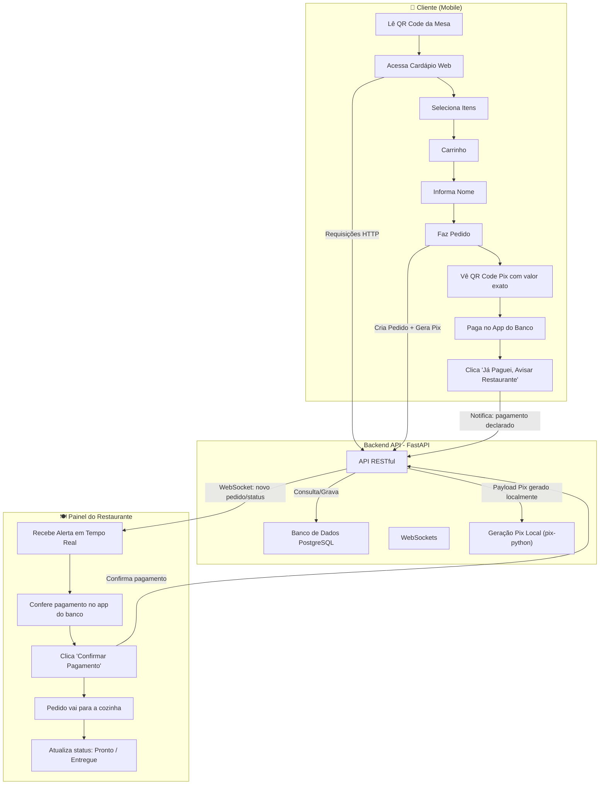

# Roadmap Técnico: Sistema de Cardápio Digital com Pedidos e Pagamento Pix

## 1. Visão Geral e Arquitetura

O objetivo é construir um sistema de cardápio digital robusto, rápido e moderno para uso em mesas de restaurante. A arquitetura é um **monolito bem-estruturado**, separando claramente o frontend do backend, simplificando o desenvolvimento e o deploy inicial.

- **Frontend**: SPA em React servindo duas interfaces: o **Cardápio do Cliente** (mobile-first) e o **Painel do Restaurante**.
- **Backend**: API RESTful em Python (FastAPI) centralizando toda a lógica de negócio: produtos, pedidos, geração do Pix e notificações em tempo real.
- **Pagamento**: Pix Estático gerado **localmente** no backend com a biblioteca `pix-python` (sem gateway, sem taxa). O valor é dinâmico conforme os itens do pedido.



---

## 2. Decisões de Design

### 💳 Pagamento Pix (sem gateway)

- O QR Code Pix é gerado **localmente** no backend usando `pix-python`
- O valor embutido no QR Code é **dinâmico** (calculado com base nos itens do carrinho)
- Nenhuma API de banco é chamada — zero custo, zero dependência externa
- A confirmação é **manual e dupla**:
  1. **Cliente** clica em "Já paguei! Avisar o restaurante"
  2. **Restaurante** confere no app do banco e clica "Confirmar" no painel

### 👤 Identificação do Cliente

Sem cadastro, sem login. O cliente é identificado por **3 dados combinados**:

| Dado | Origem | Descrição |
|---|---|---|
| `session_id` | Gerado no primeiro acesso | UUID salvo no `localStorage` do navegador |
| `table_number` | URL do QR Code | Ex: `/menu?mesa=3` — o cliente não digita |
| `customer_name` | Digitado no checkout | Apenas o primeiro nome |

**Por que o UUID?** Se dois clientes diferentes sentarem na mesma mesa em momentos distintos, cada um terá seu próprio UUID — os pedidos nunca se misturam.

**Persistência da sessão**: o UUID fica salvo no celular do cliente. Se ele fechar e reabrir o cardápio, seu pedido ativo ainda aparece. A sessão é limpa automaticamente quando o pedido é marcado como `entregue`.

### 📊 Status do Pedido

```
aguardando_pagamento → pagamento_declarado → em_preparacao → pronto → entregue
```

| Status | Quem muda | Descrição |
|---|---|---|
| `aguardando_pagamento` | Sistema | QR Code exibido, cliente ainda não confirmou |
| `pagamento_declarado` | Cliente | Clicou "Já paguei" — restaurante precisa conferir |
| `em_preparacao` | Restaurante | Pagamento confirmado no banco, vai para cozinha |
| `pronto` | Restaurante | Pedido pronto para ser entregue |
| `entregue` | Restaurante | Finalizado — session limpa no cliente |

---

## 3. Modelo de Dados

```
Category
├── id (UUID)
├── name (str)
├── description (str, opcional)
└── active (bool)

Item
├── id (UUID)
├── category_id (FK → Category)
├── name (str)
├── description (str)
├── price (Decimal)
├── image_url (str, opcional)
└── active (bool)

Order
├── id (UUID)
├── session_id (UUID)          ← identificador único do cliente no browser
├── table_number (int)         ← vem da URL do QR Code
├── customer_name (str)        ← digitado no checkout
├── status (enum)              ← aguardando_pagamento | pagamento_declarado | em_preparacao | pronto | entregue
├── total (Decimal)
├── pix_payload (str)          ← texto do QR Code Pix gerado localmente
├── observations (str, opcional)
└── created_at (datetime)

OrderItem
├── id (UUID)
├── order_id (FK → Order)
├── item_id (FK → Item)
├── quantity (int)
└── unit_price (Decimal)       ← preço no momento do pedido (histórico)
```

---

## 4. Stack de Tecnologias

| Componente | Tecnologia | Justificativa |
|---|---|---|
| **Frontend** | React + Vite + TypeScript | Build rápido, tipagem estática, base moderna |
| **UI/Estilo** | Shadcn/UI + Tailwind CSS | Componentes acessíveis, design profissional e customizável |
| **State Global** | Zustand | Simples e direto para gerenciar o carrinho |
| **Data Fetching** | TanStack Query | Cache, sync e re-fetching automático com o backend |
| **Backend** | FastAPI (Python) | Alta performance, validação automática com Pydantic, Swagger UI |
| **Banco de Dados** | PostgreSQL | Robusto e confiável para produção |
| **ORM** | SQLAlchemy 2.0 (Async) | Integração assíncrona perfeita com FastAPI |
| **Notificações** | FastAPI WebSockets | Tempo real para o painel do restaurante (novos pedidos/status) |
| **Pagamento Pix** | `pix-python` | Geração de QR Code Pix com valor dinâmico, 100% local e gratuito |
| **Geração QR Code** | `qrcode` (Python) + `qrcode.react` | Gera QR Code de acesso das mesas (backend) e exibe o Pix (frontend) |
| **Autenticação** | JWT + FastAPI OAuth2 | Protege o painel do restaurante |
| **Deploy** | Docker + Nginx + VPS Ubuntu | Containerização consistente, reverse proxy, SSL automático |

---

## 5. Estrutura de Projeto

### Backend (`/cardapio-api`)

```
cardapio-api/
├── app/
│   ├── main.py                  # Ponto de entrada FastAPI
│   ├── core/
│   │   ├── config.py            # Variáveis de ambiente (.env)
│   │   └── security.py          # Hash de senha, geração/validação JWT
│   ├── db/
│   │   ├── base.py              # Base declarativa do SQLAlchemy
│   │   └── session.py           # AsyncSession factory
│   ├── models/                  # Modelos SQLAlchemy
│   │   ├── category.py
│   │   ├── item.py
│   │   └── order.py             # Order + OrderItem
│   ├── schemas/                 # Schemas Pydantic (request/response)
│   │   ├── category.py
│   │   ├── item.py
│   │   └── order.py
│   ├── crud/                    # Funções de acesso ao banco
│   │   ├── crud_category.py
│   │   ├── crud_item.py
│   │   └── crud_order.py
│   ├── api/
│   │   ├── endpoints/
│   │   │   ├── menu.py          # GET /menu, GET /menu/{id}
│   │   │   ├── orders.py        # POST /orders, PATCH /orders/{id}/status
│   │   │   ├── payment.py       # POST /orders/{id}/declare-payment
│   │   │   └── restaurant.py   # Endpoints do painel (protegidos por JWT)
│   │   └── deps.py              # Dependências: get_db, get_current_user
│   └── services/
│       ├── pix_service.py       # Gera payload Pix com pix-python
│       └── notification_service.py  # Envia eventos via WebSocket
├── tests/
├── alembic/                     # Migrations do banco
├── alembic.ini
├── requirements.txt
└── .env
```

### Frontend (`/cardapio-web`)

```
cardapio-web/
├── src/
│   ├── App.tsx
│   ├── main.tsx
│   ├── assets/
│   ├── components/
│   │   ├── ui/                  # Componentes Shadcn (Button, Card, Badge...)
│   │   └── shared/              # Header, CartButton (flutuante)
│   ├── features/
│   │   ├── menu/                # Listagem de categorias e itens
│   │   ├── cart/                # Carrinho + checkout (nome, observações)
│   │   ├── payment/             # QR Code Pix + botão "Já paguei"
│   │   ├── order-status/        # Tela de acompanhamento do pedido
│   │   └── restaurant/          # Painel do restaurante (login + pedidos)
│   ├── hooks/
│   │   ├── useSession.ts        # Gera/recupera UUID do localStorage
│   │   └── useWebSocket.ts      # Conexão WebSocket para o painel
│   ├── lib/
│   │   └── axios.ts             # Instância configurada do axios
│   ├── services/
│   │   ├── menuApi.ts
│   │   └── orderApi.ts
│   └── store/
│       └── cartStore.ts         # Zustand: estado do carrinho
├── public/
├── package.json
├── tsconfig.json
└── vite.config.ts
```

---

## 6. Passo a Passo de Desenvolvimento

### Fase 1 — Setup e Backend Core

1. **Setup do Backend**
   - Crie a estrutura de diretórios
   - Configure o ambiente virtual e instale: `fastapi`, `uvicorn[standard]`, `sqlalchemy[asyncio]`, `asyncpg`, `alembic`, `python-jose[cryptography]`, `passlib[bcrypt]`, `python-multipart`, `qrcode[pil]`, `pix-python`
   - Configure o Alembic para as migrations

2. **Modelos, Schemas e CRUD**
   - Implemente os modelos SQLAlchemy: `Category`, `Item`, `Order`, `OrderItem`
   - Crie os schemas Pydantic correspondentes
   - Implemente as funções CRUD

3. **Endpoints do Cardápio (públicos)**
   - `GET /menu` → lista categorias com seus itens ativos
   - `GET /menu/items/{id}` → detalhe de um item

4. **Endpoints de Pedido**
   - `POST /orders` → cria pedido, calcula total, gera payload Pix com `pix-python`, salva e retorna
   - `POST /orders/{id}/declare-payment` → muda status para `pagamento_declarado`, dispara WebSocket
   - `PATCH /orders/{id}/status` → atualiza status (protegido por JWT)

5. **Autenticação do Restaurante**
   - `POST /auth/login` → retorna JWT
   - Endpoint protegido: `GET /restaurant/orders` → lista pedidos ativos

### Fase 2 — Frontend do Cliente

6. **Setup do Frontend**
   - `npm create vite@latest cardapio-web -- --template react-ts`
   - Instale e configure Tailwind CSS, Shadcn/UI, TanStack Query, Zustand, axios

7. **Cardápio (mobile-first)**
   - Lê `?mesa=X` da URL e salva na store
   - Gera/recupera UUID de sessão do `localStorage` com o hook `useSession`
   - Lista categorias e itens consumindo a API com TanStack Query
   - Botão "+" flutuante no rodapé mostrando total e quantidade

8. **Carrinho e Checkout**
   - Tela do carrinho: lista itens, quantidades, subtotais, total
   - Formulário: campo nome (obrigatório) e campo observações (opcional)
   - Botão "Fazer Pedido" → chama `POST /orders`

9. **Tela de Pagamento**
   - Exibe QR Code Pix (usando `qrcode.react` com o payload recebido do backend)
   - Exibe código "Copia e Cola"
   - Botão destacado: "✅ Já paguei! Avisar o restaurante"

10. **Tela de Acompanhamento**
    - Mostra status atual do pedido com ícone e mensagem amigável
    - Usa polling (TanStack Query refetch) ou WebSocket para atualizar em tempo real

### Fase 3 — Painel do Restaurante

11. **Login e Autenticação**
    - Tela de login com JWT

12. **Painel de Pedidos**
    - Lista pedidos agrupados por status
    - Alerta visual/sonoro para novos pedidos
    - Conexão WebSocket para receber eventos em tempo real
    - Botões de ação: "Confirmar Pagamento" → "Pronto" → "Entregue"

### Fase 4 — QR Code das Mesas e Deploy

13. **QR Code de Acesso às Mesas**
    - Script ou endpoint simples que gera QR Codes com URL `https://seusite.com/menu?mesa=X`
    - Exporta como imagem PNG para impressão

14. **Deploy**
    - `Dockerfile` para o backend e para o frontend
    - `docker-compose.yml` orquestrando: API, frontend, PostgreSQL, Nginx
    - Configure domínio e SSL (Let's Encrypt via Certbot ou Traefik)

---

## 7. Fluxos Resumidos

### Fluxo do Cliente
```
Escaneia QR da Mesa (ex: /menu?mesa=3)
  → Sistema gera UUID de sessão (localStorage)
  → Navega pelo cardápio e adiciona itens ao carrinho
  → Informa nome no checkout
  → Clica "Fazer Pedido"
  → Vê QR Code Pix com valor exato do pedido
  → Paga no app do banco
  → Clica "Já paguei! Avisar o restaurante"
  → Tela de acompanhamento mostra status em tempo real
```

### Fluxo do Restaurante
```
Recebe alerta WebSocket: "Mesa 3 - João - R$ 42,50 - Pagamento Declarado"
  → Confere no app do banco se o Pix caiu
  → Clica "Confirmar Pagamento" no painel
  → Prepara o pedido
  → Clica "Pronto"
  → Entrega e clica "Entregue"
  → Sessão do cliente é liberada automaticamente
```
